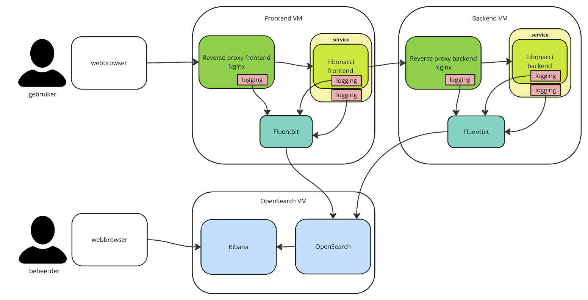
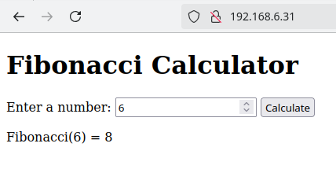

# Centralized logging with VMs demo

The IT world is moving towards cloud computing, but not every company is ready, willing or able.
However centralized logging is a powerful technique to get more value from log files and
make finding issues much easier.

This demo shows one set of tools that can be used to accomplish centralized logging in
VM (but also physical machines) environments:

- [Fluent Bit](https://fluentbit.io/): used to aggregate logging and send it to a central server,
- [OpenSearch](https://opensearch.org/): storage and indexing of log event,
- [OpenSearch Dashboards](https://www.opensearch.org/docs/latest/dashboards/): web UI to analyze and visualize information from log events.

## Prerequisites

- [VirtualBox](https://www.virtualbox.org/), tested with 7.0.20
- [Vagrant](https://www.vagrantup.com/), tested with 2.4.1

## Setup

```bash
vagrant up
```

This will create three VMs:



A simple application is running as a distributed system:

- an Nginx reverse proxy for the frontend,
- a frontend application (running as a service) that serves simple HTML and forwards request to the backend that does the actual calculation,
- an Nginx reverse proxy for the backend,
- a backend application (also running as a service) that does the actual calculation.

In total this application generates six log files. These log files are read and parsed by Fluent Bit and then sent to OpenSearch.
OpenSearch stores and indexes each event. OpenSearch Dashboards can then be used to view and visualize the information from the logs.

## Teardown

```bash
vagrant destroy -f
```

Note that this will remove all collected data. To delete the Vagrant boxes you have to use extra commands:

```bash
vagrant box list
vagrant box remove <box name>
```

## Generating logs

### Using the Fibonacci calculator

Point a browser to http://192.168.6.31, fill in some number and press 'Calculate'.



### Using the test script

On the host, run

```bash
./test/test-setup.sh
```

This will also run some tests that check if logging is created correctly.

## View logs

### Using OpenSearch API

```bash
curl -k -X GET "https://192.168.6.33:9200/fibonacci-*/_search" \
-u 'admin:T!mberW0lf#92' \
-H "Content-Type: application/json"
```

### Using OpenSearch Dashboards

You'll get a much better experience when using OpenSearch Dashboards.
Point your browser at http://192.168.6.33:5601, login with user name ```admin``` and password ```T!mberW0lf#92```.
Then press the hamburger menu in the top left and select Discover.

## Scenarios

### Following a request over multiple logs using request ID

### Saving searches (why? what's the use case?)

### Filtering logs by level

Looking at log files that includes all levels (from TRACE to CRITICAL) is a lot of work.
Most of the time you're not interested in the lowest level of logging (until you find the proper spot to dive deeper).
Focussing on high levels first and then dig deeper into lower levels is very easy with Kibana:

- First add a filter that only shows warnings and errors
- Find the timestamp or request ID that has an issue
- Filter on that timestamp/request ID and open the filter so it shows lower level log events

TODO: hoe gaat ik dit proces laten zien in deze demo?
Fout introduceren bij specifiek request? Bv panic bij 27372.

### Creating dashboard from saved search

### Creating alert on number of errors

### Creating alert on application services not started

## Issues

Centralized logging is not a silver bullet, there are still some issues that make analyzing logs a challenge:

- Clock skew: computer clocks of separate machines are not synchronized to within one millisecond. This means that causality is not preserved.
An example: event A happens on machine A which causes event B to happen on machine B. When B's clock is ahead of A's clock, the
log of event B may have an earlier timestamp than event A. So when looking at the combined logs it will look like event B
occurred before event A.

There are solutions for these issues:

- A protocol like [PTP](https://en.wikipedia.org/wiki/Precision_Time_Protocol) (Precision Time Protocol)
can be used to minimize the clock skew between computer clocks,
- or increasing sequence numbers can be added to events to make the order of events explicit.

In this demo these solutions were not implemented to keep the demo simple.

## Interesting stuff I had to figure out

- How to use microsecond precision timestamps in OpenSearch.
- How to write Nginx access logs as json.
- How to write structured logging in Rust.
- How to let Nginx generate a request ID.
- How to pass that request ID through the whole chain.
- How to have Fluentbit properly parse Nginx error log.
- How to have Fluentbit use the journal as input to read the logs of a single service.

## TODO

- create scenarios
- field log has conflict in types
